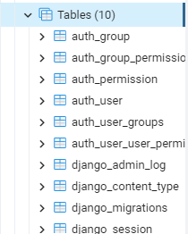

# ModelsProjectDjango

Este proyecto tiene como objetivo practicar lo aprendido en OpenBootcamp (https://open-bootcamp.com/), sobre creación de modelos haciendo uso del framework Django y el lenguaje Python, y al mismo tiempo servir de guía para aquellos desarrolladores que también están interesados en practicar y aprender sobre estas tecnologías.

Cabe destacar que es un proyecto bastante sencillo y relativamente básico por lo que si eres un desarrollador avanzado en este entorno quizás no te sea de tanta utilidad.

# Pasos a seguir

## Entorno Virtual

Creamos el Entorno Virtual:

```bash
$ python -m venv venv
```

Activamos el Entorno Virtual:

```bash
$ source venv/Scripts/activate
```

Instalar Django en un entorno virtual:

```bash
$ pip install Django
```

## Inicializamos el proyecto

- En primer lugar debemos iniciar el proyecto (models_project), para ello escribimos el siguiente comando en consola:

```bash
django-admin startproject models_project
```

- Posteriormente debemos crear una aplicación que llamaremos company y la que contendrá los modelos y rutas necesarias para implementar las funcionalidades y que quede todo ordenado y modularizado.

```bash
python manage.py startapp company
```

- Debemos incorporar a nuestro settings.py de models_project la aplicación company como se muestra a continuación:

```Python
# Application definition

INSTALLED_APPS = [
    'django.contrib.admin',
    'django.contrib.auth',
    'django.contrib.contenttypes',
    'django.contrib.sessions',
    'django.contrib.messages',
    'django.contrib.staticfiles',
    'company',
]
```

- Podemos corroborar que ha sido instalada correctamente con el siguiente comando:

```bash
python manage.py check company
```

Debería devolvernos lo siguiente:

```bash
System check identified no issues (0 silenced).
```

# Creamos la Base de Datos:

- En este proyecto utilizaremos PostgreSQL como sistema de permanencia de datos. Para configurar la conexión a la misma debemos dirigirnos al settings.py de nuestro proyecto para configurar las variables de entorno (Documentación: https://docs.djangoproject.com/en/4.1/ref/databases/)

Creamos un archivo .env en la raíz del proyecto y donde colocaremos las variables de entorno para luego llamarlas dentro de settings.py

```bash
# Settings.py
import os
from decouple import config

BASE_DIR = os.path.dirname(os.path.dirname(os.path.abspath(__file__)))

SECRET_KEY = config('SECRET_KEY')

DATABASES = {
    'default': {
        'ENGINE': 'django.db.backends.postgresql',
        'NAME': config('DB_NAME'),
        'USER': config('DB_USER'),
        'PASSWORD': config('DB_PASSWORD'),
        'HOST': '127.0.0.1',
        'PORT': '5432',
    }
}
# -----------------------------
# .env:
DB_NAME='company',
DB_USER='postgres',
DB_PASSWORD = '********',
```

- Vinculamos la BD con nuestro proyecto en django:

```bash
python manage.py migrate
```

Para este punto deberíamos poder ver en PgAdmin las bases de datos creadas por defecto por Django:



# Estructura de la Base de Datos:


